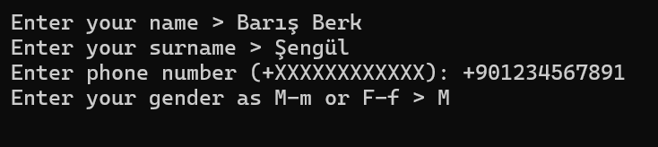

# Data-Input-to-Json

In the "Data Converter" folder, you can find the complete program. 

To get started:

1. **Clone the Repository:** Clone the repository to your system using Git:
   ```bash
   git clone <repository-url>
   ```

2. **Open in Any IDE:** Open the project in your preferred Integrated Development Environment (IDE). You can use editors like Visual Studio Code, JetBrains IntelliJ IDEA, or any other IDE of your choice.
<br>


3. **Build the Project:** Once the project is opened in your IDE, build the project to compile the source code. This will generate the executable file required for running the program.

4. **Run the Executable File:** After successfully building the project, navigate to the folder containing the executable file and run it. You can typically run it by double-clicking the executable file or executing it from the terminal/command prompt.
<br>

<br>
5. **Input Data:** Follow the instructions provided by the program to input your data.

6. **Check JSON File:** Once the program has processed your input data, check the generated JSON file named ```written_data.json```. This file should contain the converted data in JSON format. You can open and inspect the JSON file using a text editor or any JSON viewer tool.

<br>
<br>
By following these steps, you can effectively use the "Data-Input-to-Json" program to convert your input data into JSON format.

